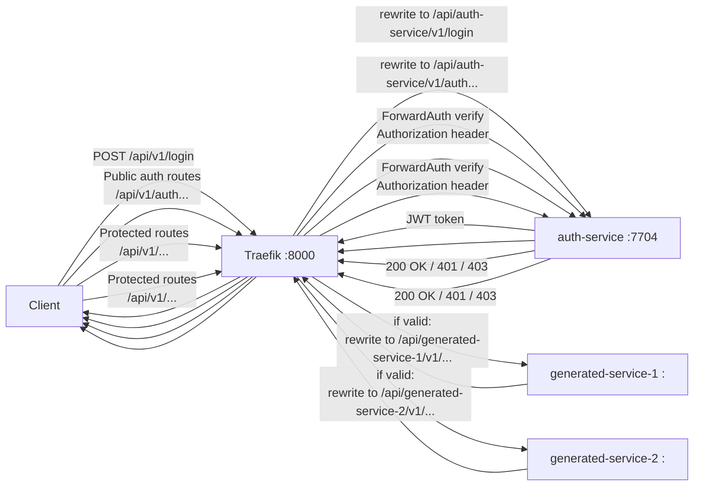

# Go Fiber Microservice Generator

Build Go Microservices Effortlessly with a `Fiber` & `Traefik` Code Generator

Live Generator app:
**https://jiwomdf.github.io/go-fiber-microservice-generator/**

## What It Includes

- Generated microservices, including an `auth-service`
- `Traefik` gateway configuration
- A root `docker-compose.yml` for easy setup

## Why It's Useful

- Great for prototyping and planning
- Automatically generates:
  - Go Fiber service code
  - SQL migrations
  - Protobuf definitions
  - Traefik configuration
  - Dockerfiles
  - OpenAPI specifications
  - Integrated docker-compose setup
- Provides a simple microservices architecture with `Go Fiber` and a `Traefik gateway`

## How to Use

1. First open the [Live Generator App](https://jiwomdf.github.io/go-fiber-microservice-generator/), fill in the required service details, and click `Generate`.

2. Extract the downloaded ZIP file, then navigate to the project directory and run the following command:

```bash
docker compose up --build
```

## Graph of the microservices with Traefik


